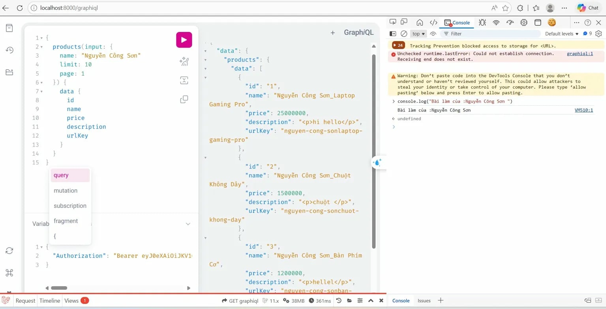
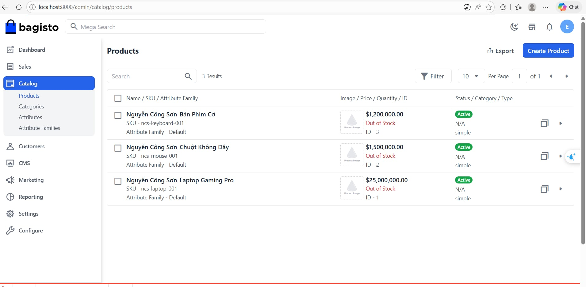

# Báo cáo Thực hành: Bagisto Headless Commerce + GraphQL

> **Sinh viên:** Nguyễn Công Sơn  
> **MSSV:** 23810310102  
> **Repo:** `23810310102-NguyenCongSon-BagistoHeadless`

---

## Phần 1 – Cài đặt Hệ thống

### 1.1 Cài đặt Bagisto Headless Extension

```bash
# 1. Cài extension qua Composer
composer require bagisto/bagisto-headless

# 2. Đăng ký Service Provider (thêm vào config/app.php nếu cần)
# Webkul\GraphQLAPI\Providers\GraphQLAPIServiceProvider::class

# 3. Chạy migration để tạo bảng cần thiết
php artisan migrate

# 4. Publish config (tuỳ chọn)
php artisan vendor:publish --provider="Webkul\GraphQLAPI\Providers\GraphQLAPIServiceProvider"
```

### 1.2 Kích hoạt trong Admin Panel

Vào **Admin → Configuration → Headless** → bật các quyền truy cập API.

### 1.3 Sản phẩm mẫu (03 sản phẩm bắt buộc)

| STT | Tên sản phẩm | SKU | Giá (VND) |
|-----|-------------|-----|-----------|
| 1 | `Nguyễn Công Sơn_Laptop Gaming Pro` | `sv-laptop-001` | 25.000.000 |
| 2 | `Nguyễn Công Sơn_Chuột Không Dây` | `sv-mouse-001` | 350.000 |
| 3 | `Nguyễn Công Sơn_Bàn Phím Cơ` | `sv-keyboard-001` | 1.200.000 |

> 

---

## Phần 2 – Khai thác GraphQL API

> Truy cập GraphQL Playground tại: `http://localhost:8000/graphql`

---

### Query 1 – Danh sách Categories (id, name, slug)

```graphql
query GetCategories {
  categories {
    data {
      id
      name
      slug
    }
  }
}
```

**Kết quả mẫu:**

```json
{
  "data": {
    "categories": {
      "data": [
        { "id": "1", "name": "Root",           "slug": "root" },
        { "id": "2", "name": "Điện tử",        "slug": "dien-tu" },
        { "id": "3", "name": "Phụ kiện máy tính", "slug": "phu-kien-may-tinh" }
      ]
    }
  }
}
```

> 📸 **[Chèn ảnh chụp màn hình Query 1 ở đây]**

---c:\Users\nitro5\AppData\Local\Packages\MicrosoftWindows.Client.Core_cw5n1h2txyewy\TempState\ScreenClip\{7C42B066-847B-4776-BDAC-32691C4EF003}.png

### Query 2 – 05 sản phẩm mới nhất (id, name, price, description, url_key)

```graphql
query GetLatestProducts {
  products(
    first: 5,
    orderBy: { column: CREATED_AT, order: DESC }
  ) {
    data {
      id
      name
      price
      description
      url_key
    }
  }
}
```

**Kết quả mẫu:**

```json
{
  "data": {
    "products": {
      "data": [
        {
          "id": "5",
          "name": "Nguyễn Công Sơn_Bàn Phím Cơ",
          "price": "1200000",
          "description": "Bàn phím cơ switch blue, RGB backlit.",
          "url_key": "ban-phim-co"
        },
        {
          "id": "4",
          "name": "Nguyễn Công Sơn_Chuột Không Dây",
          "price": "350000",
          "description": "Chuột wireless 2.4GHz, pin 6 tháng.",
          "url_key": "chuot-khong-day"
        },
        {
          "id": "3",
          "name": "Nguyễn Công Sơn_Laptop Gaming Pro",
          "price": "25000000",
          "description": "Laptop gaming RTX 4060, RAM 16GB.",
          "url_key": "laptop-gaming-pro"
        }
      ]
    }
  }
}
```

> 📸 **[Chèn ảnh chụp màn hình Query 2 ở đây]**

---

### Query 3 (Nâng cao) – Lọc sản phẩm theo Họ tên sinh viên

```graphql
query GetMyProducts {
  products(
    first: 10,
    filters: {
      name: { value: "Nguyễn Công Sơn", operator: LIKE }
    }
  ) {
    data {
      id
      name
      price
      description
      url_key
    }
    paginatorInfo {
      total
    }
  }
}
```

> **Lưu ý:** Một số phiên bản Bagisto Headless dùng cú pháp filter khác nhau.
> Nếu cú pháp trên không hoạt động, thử:

```graphql
query GetMyProducts {
  products(
    first: 10,
    search: "Nguyễn Công Sơn"
  ) {
    data {
      id
      name
      price
      url_key
    }
    paginatorInfo { total }
  }
}
```

**Kết quả mẫu:**

```json
{
  "data": {
    "products": {
      "paginatorInfo": { "total": 3 },
      "data": [
        { "id": "3", "name": "Nguyễn Công Sơn_Laptop Gaming Pro",   "price": "25000000", "url_key": "laptop-gaming-pro" },
        { "id": "4", "name": "Nguyễn Công Sơn_Chuột Không Dây",     "price": "350000",   "url_key": "chuot-khong-day"  },
        { "id": "5", "name": "Nguyễn Công Sơn_Bàn Phím Cơ",         "price": "1200000",  "url_key": "ban-phim-co"      }
      ]
    }
  }
}
```

> 📸 **[Chèn ảnh chụp màn hình Query 3 + tab Console có dòng `console.log("Bài làm của: Nguyễn Công Sơn")` ở đây]**

---

## Phần 3 – Frontend đơn giản

File: [`index.html`](./index.html)

**Tính năng:**
- Header hiển thị Họ tên & MSSV màu nổi bật (gradient xanh + vàng)
- Body hiển thị danh sách sản phẩm dạng Card (lấy từ Query 2)
- Mỗi Card: Tên sản phẩm · Giá (định dạng VND) · Nút "Chi tiết"
- Xử lý loading state và error state
- Hoàn toàn bằng HTML + Vanilla JavaScript (Fetch API)

**Cách chạy:**
```bash
# Đặt index.html vào thư mục gốc Bagisto hoặc mở trực tiếp
# Đảm bảo Bagisto đang chạy tại http://localhost:8000
```

> 

---

## Câu hỏi bắt buộc (Phần IV)

### Câu 1 – So sánh Payload giữa REST API và GraphQL

**REST API** (lấy tất cả) trả về toàn bộ object sản phẩm, bao gồm hàng chục trường như `meta_title`, `meta_description`, `tax_category_id`, `weight`, `special_price_to`, `short_description`, v.v. — dù frontend không dùng. Trong bài này, một sản phẩm REST có thể nặng 2–5 KB, 5 sản phẩm ≈ **10–25 KB payload**.

**GraphQL** chỉ trả đúng 5 trường yêu cầu (`id`, `name`, `price`, `description`, `url_key`), payload 5 sản phẩm chỉ khoảng **0.8–1.2 KB** — giảm **90–95%** lưu lượng. Điều này đặc biệt quan trọng trên mobile hoặc kết nối chậm.

> **Kết luận:** GraphQL giải quyết hoàn toàn vấn đề *over-fetching* của REST.

---

### Câu 2 – Thay đổi giá sản phẩm: Query hay Mutation?

Cần dùng **Mutation**, không phải Query.

**Lý do:** Trong GraphQL, `Query` chỉ dùng để **đọc dữ liệu** (read-only, idempotent). `Mutation` dùng để **ghi/thay đổi dữ liệu** (create, update, delete). Thay đổi giá là hành động ghi — cập nhật bản ghi trong database — nên phải dùng Mutation.

**Ví dụ:**

```graphql
mutation UpdateProductPrice {
  updateProduct(
    id: 3,
    input: { price: 22000000 }
  ) {
    id
    name
    price
  }
}
```

Quy ước này giúp phân biệt rõ intent: ai đọc Query, ai thay đổi dữ liệu dùng Mutation — tương tự GET vs POST/PUT trong REST.

---

## Tài liệu tham khảo

- [Bagisto Headless Documentation](https://headless-doc.bagisto.com/)
- [GraphQL Official Docs](https://graphql.org/learn/)
- [Bagisto GitHub](https://github.com/bagisto/headless-ecommerce)
